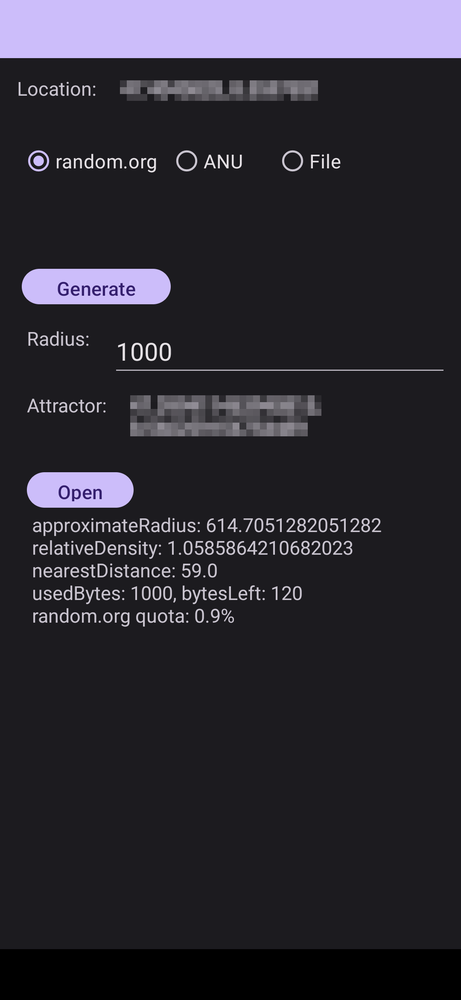

# LibreRandonaut

LibreRandonaut is an open-source Android app for generating true random coordinates that allow users to explore their surroundings and perform the activity "randonauting". 

It interfaces with [random.org](https://www.random.org/randomness/) as well as the [QRNG at the Australian National University](https://qrng.anu.edu.au/). From these providers it receives a list of quantum random numbers which are converted into coordinates. The Gaussian kernel density estimate of these coordinates is calculated to find the point with a statistically anomalous density.

If you're unfamiliar with Randonauting, the concepts of Probability Blind-Spots and Quantum Randomness, I recommend reading [fatum_theory.txt](https://github.com/anonyhoney/fatum-en/blob/master/docs/fatum_theory.txt) that came with the original Fatum project bot that inspired Randonautica. If you have no idea what this is about and are completely new to this field, you should read [this article](https://medium.com/swlh/randonauts-how-a-random-number-generator-can-set-you-free-dfc2a2413e15).

## Table of contents
* [Usage](#usage)
* [Entropy sources](#entropy-sources)
	* [Random.org](#randomorg)
	* [ANU](#anu)
	* [File](#file)
* [To-do](#to-do)
* [Download](#download)
* [Screenshots](#screenshots)

# Usage
- Enable GPS in your phone
- Chose the entropy source
- Set the radius or leave at the default value of 1000m
- Press Generate button to start generating an attractor in the defined area around your location
- When generation finishes, press Open to open the attractor's location in a navigation app

# Entropy sources
## Random.org

Random.org is a true random number generator which generates random numbers from atmospheric noise. This is the fastest way to generate attractors, since access is instantaneous and the contingent is sufficient to generate about 100 attractors at a radius of 1000 .

## ANU
See [QRNG at the Australian National University](https://qrng.anu.edu.au/). 

The original API for ANU was limited to one request per minute. For the generation of an attractor within a radius of 1000 meters several requests are needed. This leads to a waiting time of about 4 minutes.

## File
Another interesting aspect is the temporal independence between generating the entropy and applying it in the context of randonauting. You can generate entropy and use it for randonauting at any time later. The results of randonauting should be similar as if you would generate entropy directly, for example by ANU.

If you choose a file as entropy source, you must have a binary file with random bytes on your phone. You can generate this file with a RNG hardware device or download it from [random.org/bytes](https://www.random.org/bytes/). The LibreRandonaut app takes care not to use the same bytes from an entropy file more than once. As soon as all bytes from the file are used up for generation, a warning message is displayed if another attempt is made.

If you provide a file, make sure it contains enough entropy. To generate one attractor per 1000m radius, 100 data points are required. Each data point requires 8 bytes, 1000m radius requires around 1200 bytes of entropy.

# To-do
- Improvement of the user interface and more usability.
- Code includes logic for accessing a homebuilt TRNG device via the USB port. This feature has been removed from the UI to not confuse the user.
- The old ANU API will be scaled back until it is eventually retired. The new AWS hosted ANU API requires a API-key and is limited to 100 requests per months for the trail tier. See [quantumnumbers.anu.edu.au/faq](https://quantumnumbers.anu.edu.au/faq). Implement functionality for providing an API-key via the LibreRandonaut app.

# Download
TODO
<!---              -->

# Screenshots

 

